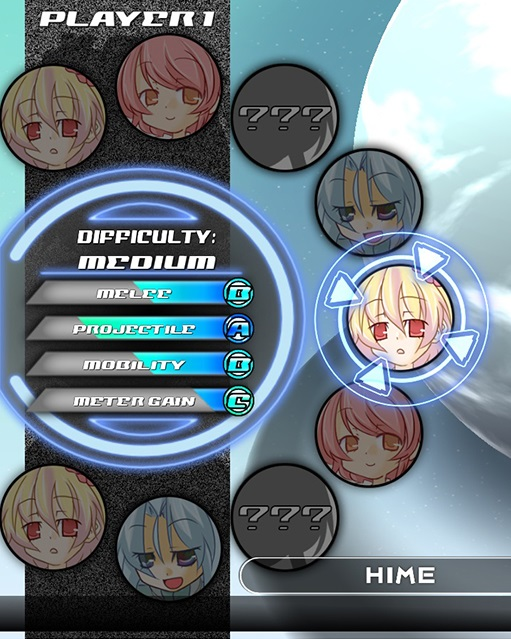

# AoS2 Save Editor

Save editor for [Acceleration of SUGURI 2](https://store.steampowered.com/app/390710/Acceleration_of_SUGURI_2/).
Gives no competitive advantage.

Supported game version: `ver 1.9.0`

## What is it for?

If any of that describes you:

- Lost the save file, but don't wanna grind to unlock characters.
- Tired of rolling Sham if you main Random Character.
- Want to remove Iru from the game.
- Simply want all the things here and now.

Then this tool is for you. 

## Download

Look for [the latest release here](https://github.com/DOCtorActoAntohich/aos2-save-editor/releases)

- Windows release has the `.exe` extension.
- Linux release is without the extension.

Since the app is very small and not widely used,
Windows defender **will scream at it**
because it doesn't have many user approvals.
I can't do much about it, sadly. 

It's up to you to proceed.
You can always just view the code and build it yourself too.

### Features

With this app, you can do the following:

- Unlock locked characters.
- Lock characters unlocked by default - no more Sham or Iru.
- Unlock all music and arena backgrounds.
- Use all customization options for your online profile.
  - Skip the training and become Sham Specialist.
  - Use title and character combinations that are
    not available from the game UI,
    including hidden 100O% OJ goobers.

However:

- You CANNOT unlock DLC music.
  - It's checked on the steam client, not in the savefile.
    That's intended and there's no way around it.
- You CANNOT unlock DLC costumes.
  - Same reason.





## Why this project exists

Here are all the reasons:

- AoS2 is the best game ever made.
- I wanted to cook a non-useless Rust project.
- Always wanted to make some TUI app cos `nvim` is cute and inspiring.

## How to run

First of all, make sure you ran the game at least once.
Might need to go to your online profile settings too.
It is to ensure it generates all the files.

By default, the app will pick one of the known (cursed) locations.
Usually works first try on Windows, and may or may not work on Linux.

On Windows, simply double-click the app.
On Linux (or on Windows if you're epic)
you can run it from the command line as follows.

```bash
aos2-save-editor
```

When the app spits `file not found` error,
you may need to specify the path to your saves folder.

- On Windows, it's usually: `C:/users/<user>/Documents/Fruitbat Factory/AoS2`.
  Unless you have an exotic setup...
- On Linux, only god can help you.

You can find one of the player files through your home directory with this command.

```bash
find ~ -name "player.rkg"
```

Then just copy the absolute path to the directory where this `player.rkg` rests.
It may look something like this (notice the quotes because of spaces in the path).

```bash
aos2-save-editor "$HOME/path/to/Documents/Fruitbat Factory/AoS2"
```

## Issues

A few problems to for the future.

- I haven't been able to figure out all the fields in the savefile.
  [`easydiff`](./crates/easydiff/) crate in this workspace can help with that.
- I didn't use all the data from the save files.
  Thought like it wasn't really necessary.
  May do something with it in the future though.

## License

Licensed under [MIT license](./LICENSE)

## Credits

Hono is genius.

He drew cool girls and I screenshotted one for the app Icon.
